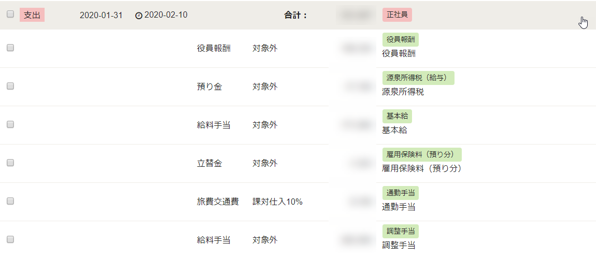
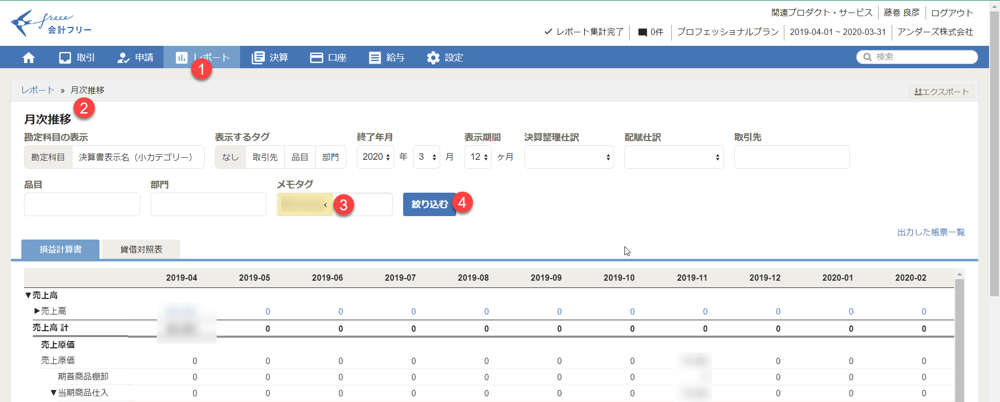

労務freee上で給与明細を確定すると会計freeeに伝票が作成されます。ここでは、役員報酬と全員分の給与が混在していて、従業員ごとの損益を見ることができません。そのため、仕訳伝票を作り、給与や通勤手当にタグ付けすることで、個人ごとの損益を見ることができるようになります。

> **仕訳の手順と例はここに追加してください。**

> **TIP**: メモタグを使って従業員ごとの損益を表示する。

