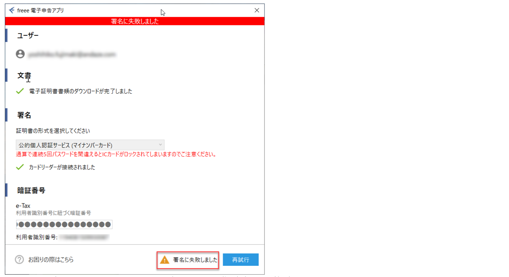
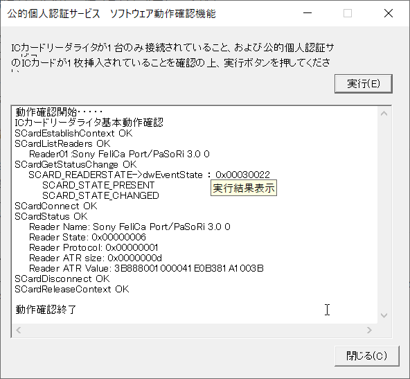
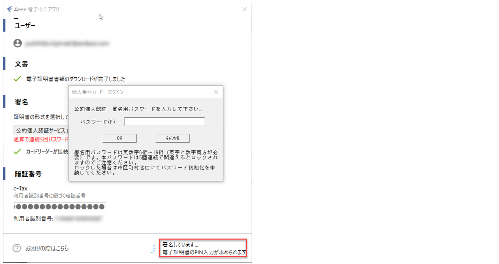
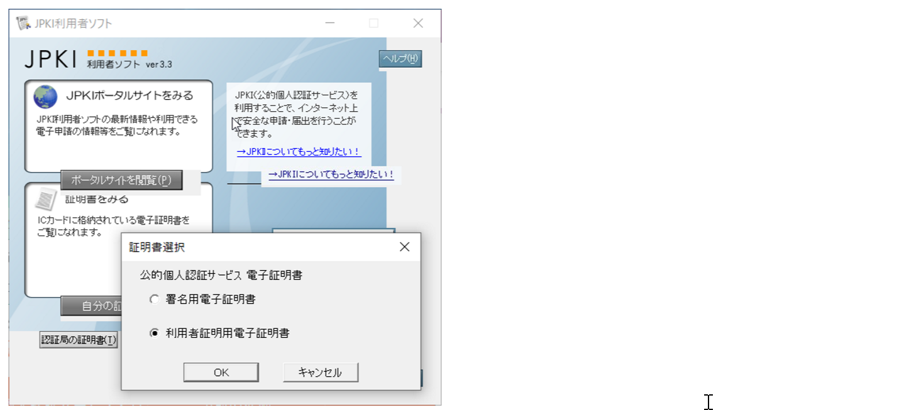
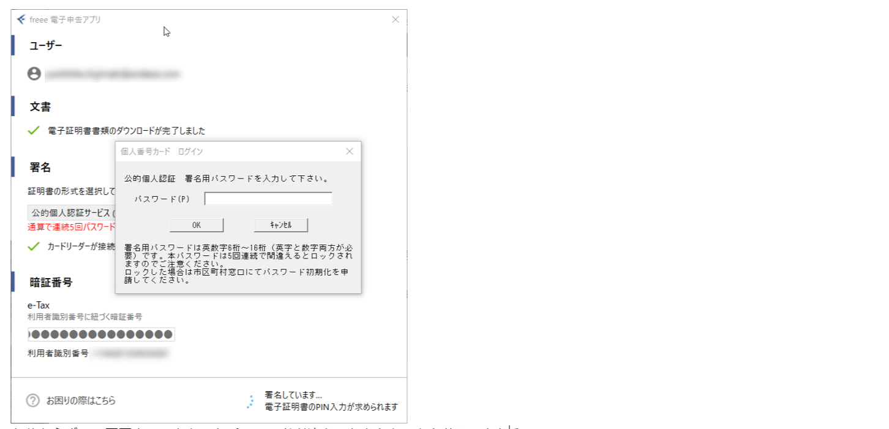
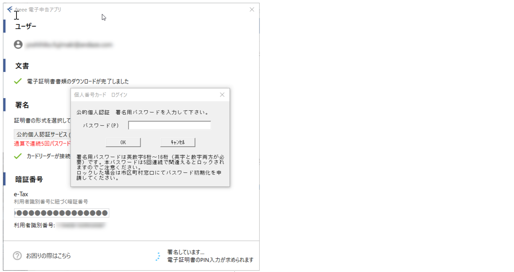

- **TIPS:** e-TaxでPINの入力までいって、そのあと、このエラーが出るなら、カード位置を動かす。反対に向ける。（実際に改善した）

freeeのドキュメントによると以下の通り。

> 初期設定が完了していない可能性があります。
こちらから、公的個人認証サービス 利用者クライアントソフト（JPKI利用者ソフト）をダウンロードして、インストールしたら、利用者クライアントソフトの証明書を見るで自分の証明書が見られるか確認をします。その後、**一度パソコンを再起動**してから再度申告をお試しください。

- **IMPORTANT:** 再起動は必ずする

# JPKI利用者ソフトにてICカードリーダーで読み書きできることを確認

- マイナンバーカードを乗せた状態でテストした結果、すべてがOKとなること。

- このソフトで設定ができている前提。試験する機能を使って、全部OKになるように。だめなら、カード位置を動かすなど。

- この画面までいってないのは、**利用者識別番号に紐づく暗証番号**（アルファベット混在の16桁）が正しくない。何回もパスワードを間違えてロックされる前に、国税庁のホームページより変更する。

自分の証明書見る

