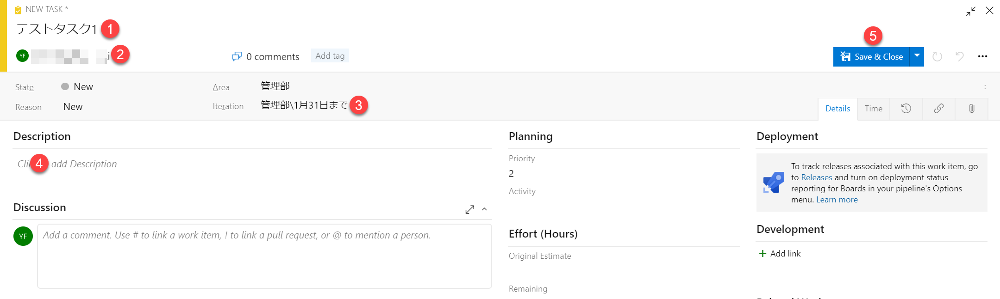
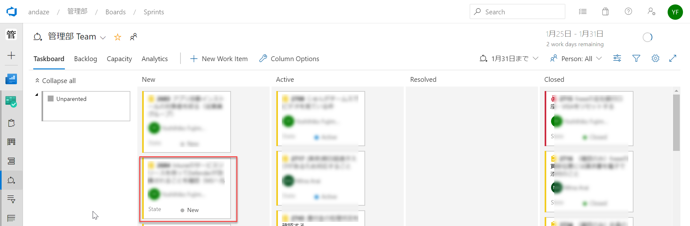
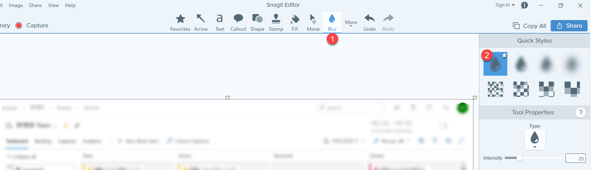

画像のキャプチャーをとって、文章を分かりやすくします。ここではSnagit画面キャプチャーツールを使って、張り付ける画像の作成について記します。

# クリックや入力する場所には赤丸で囲んだ数字を置きます
画像の例です。

# 最終的な結果は赤枠で囲みます
画像の例です。

# 説明に必要ないデータはぼかします

セキュリティ上または手順に集中するために、データ部分をSnagitのブラーツールを使って、ぼかします。

# その他のポイント
- **画像は最大化してキャプチャーします。**
- **縦は程度にカットします**。フル画面をのせると本文が圧迫されます
- **画面上部にあるメニューやナビゲーションは原則として残します。** 画面の所在がわかるたえに、カットしません。
- **横幅はバランスを考えてカットしないことがあります**。画像のスケールが変わってしまい、マニュアルのデザインが歪になります。
