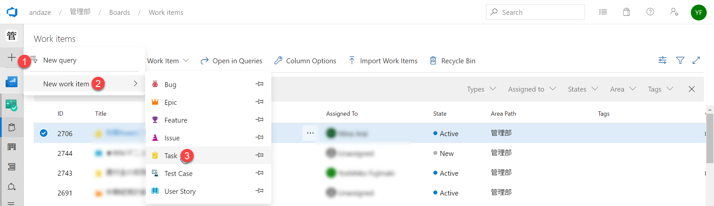
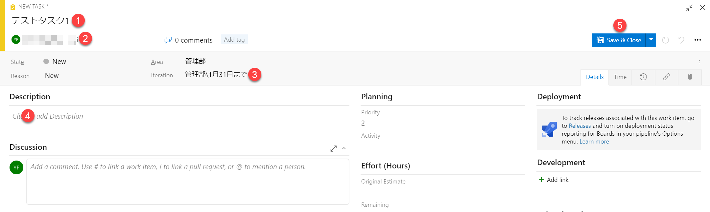
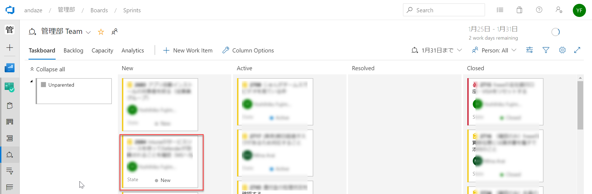
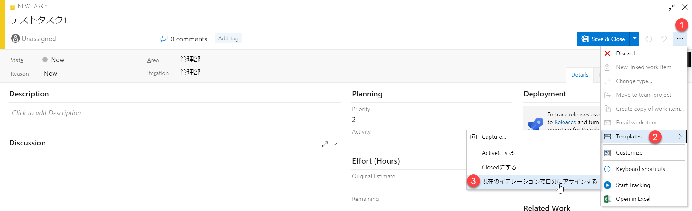
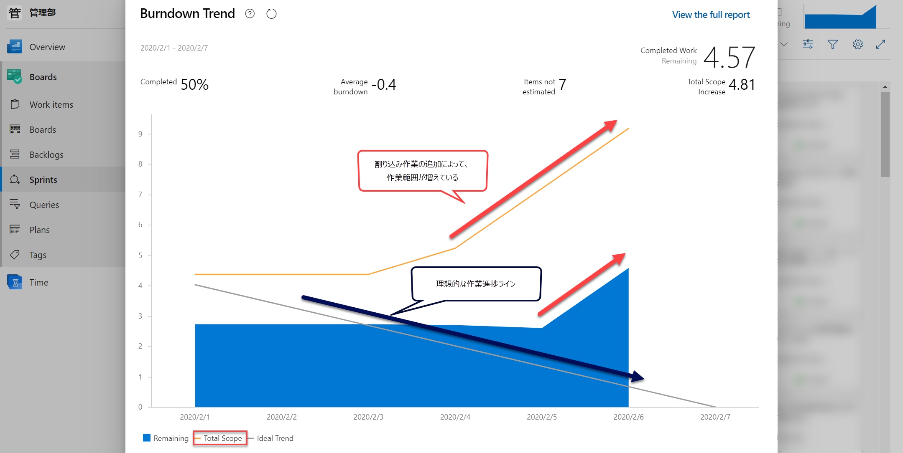

割り込みで発生したタスクの作業項目を作る方法について記します。

# 右側の**＋**から**Task**をクリックします。

# タスクのダイアログが開いたら、**題名**、**アサイン**、**イテレーション**、**内容**を入力して、**保存**ボタンを押します。

- **注意**: なるべく翌週以降のタスクとして入れるようにします。現在の週に追加すると、当該週の計画された仕事がいつまでも終了しないことになります。

# Unparented（親なし）の下に新しくタスクが追加されています

> **TIPS:** テンプレートのメニューに「現在のイテレーションで自分にアサインする」が存在する場合は、イテレーションとアサインの自動入力ができます。今の週にどうしてもやる必要がなければ、イテレーションはバックログとしておきます。

> **IMPORTANT**: 割り込みタスクを増やすと、計画外の作業が増えて（合計スコープのグラフ）、予定の仕事が終了しなくなりますので、注意してください。

