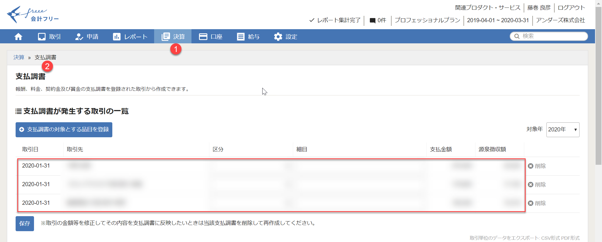
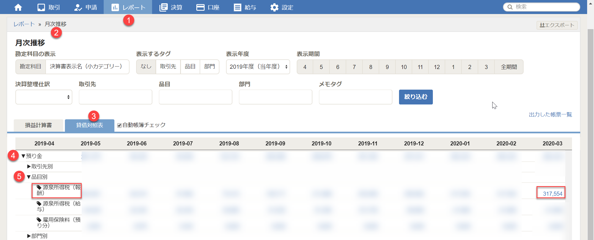

1. 支払調書より前月の源泉徴収額を確認します。

2. 合計額を計算するために、当月支払い対象分を、範囲指定をして**エクセル上でCTRL+V**でコピーします。

3. Excelへ張り付けて合計額を計算します。**これを源泉の納付金額とします**ので、控えてください。

> **TIPS**: CSVファイルをダウンロードして計算する方法もありますが、コピーペーストしたほうが楽です。

4. 貸借対照表の期末または当月の額と、**合致することを確認**します。合致しない場合は、原因を見つけて、修正を行います。

以上で源泉納付額の算出ができました。

