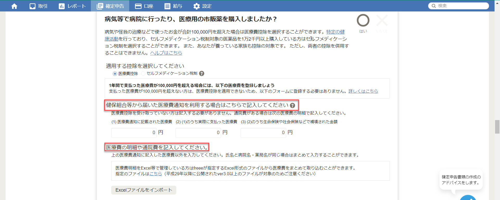

freeeでは2種類の医療費控除の方法があります。

- 組合から届いた医療費通知を利用する
- 医療の明細を記入する

:warning: 医療費通知は証明書の郵送が必要です。

- e-Tax 添付書類の送付
https://www.e-tax.nta.go.jp/tetsuzuki/tetsuzuki3.htm

- e-Taxを利用して所得税の確定申告書を提出する場合の「生命保険料控除の証明書」などの第三者作成書類の添付省略の制度について教えてください
https://www.e-tax.nta.go.jp/toiawase/qa/kakutei/tempu01.htm
