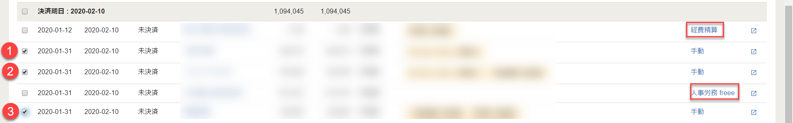
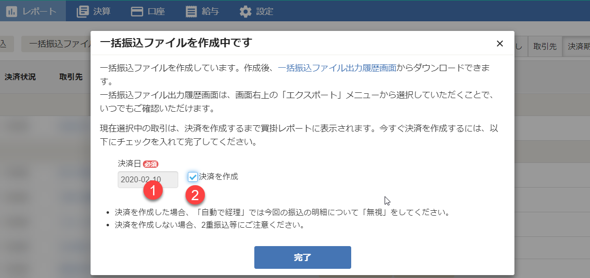
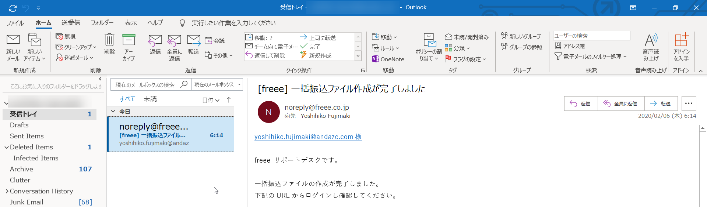
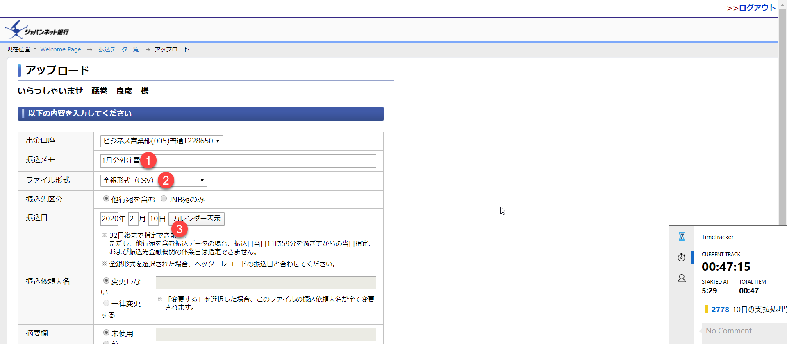

会計freeeより操作をします。

- **支払管理レポート**より対象を選びます。経費精算と人事労務freeeの行は除外します。

- **一括振込ファイル**を作成します。引き落とし日には決済日を指定します。

- **決済日**を入力します。

> **TIPS**: 一括振込ファイルはメールにて届きます。通常は数分もかかりません。

- ジャパンネット銀行でWEB総合振込の手続きをします。

