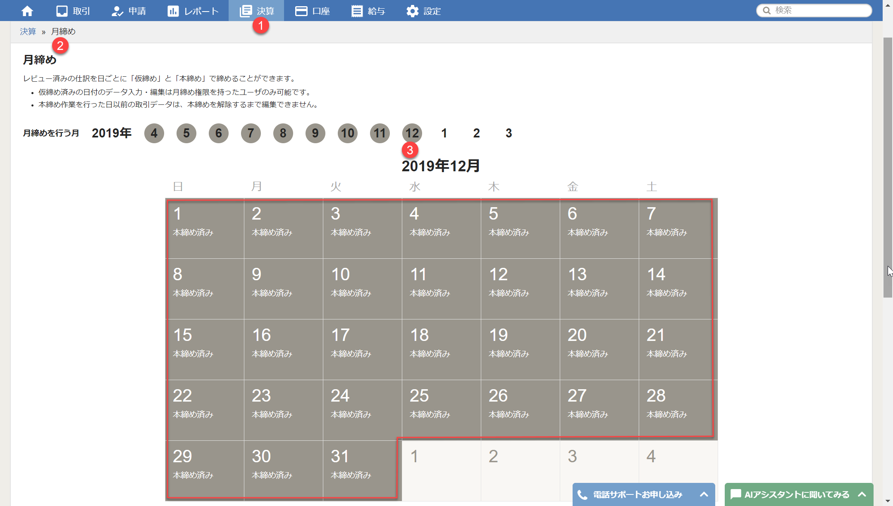
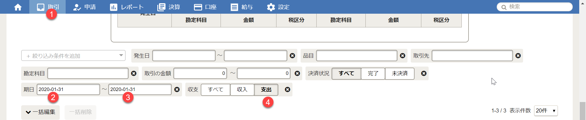
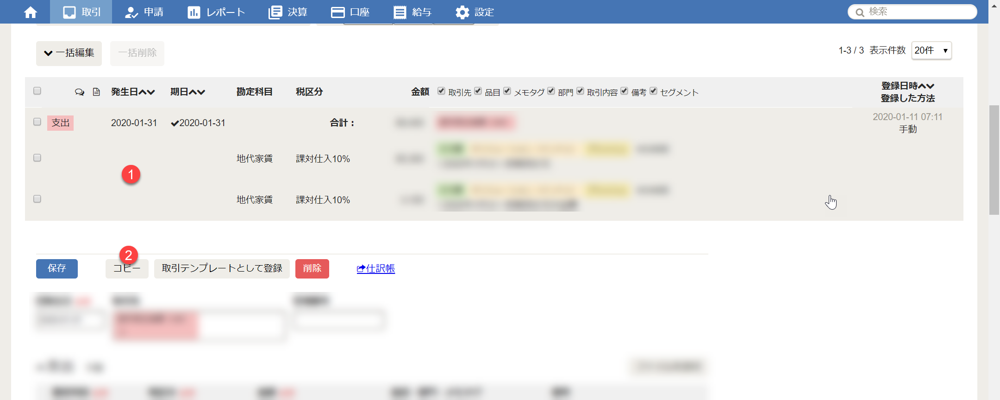
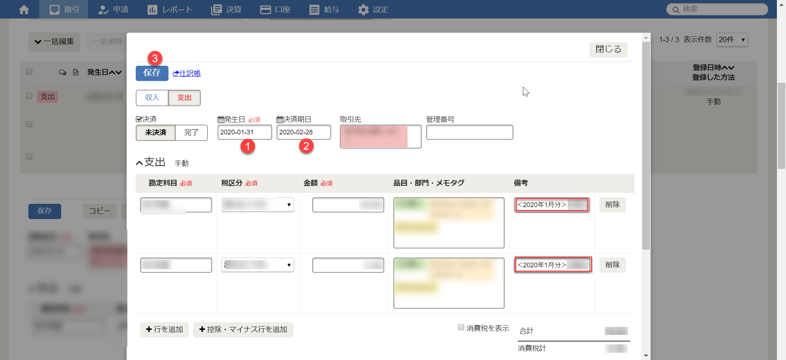
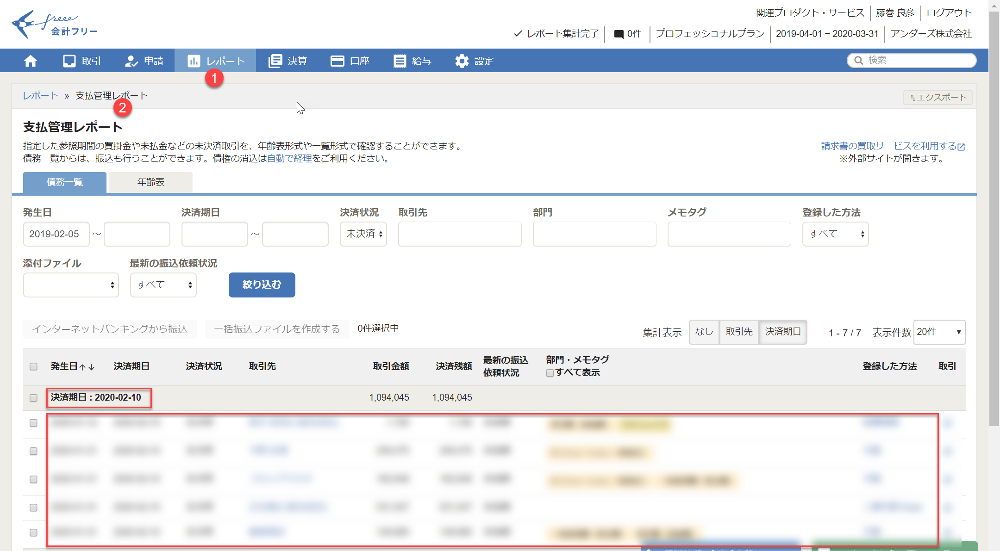

月末近くなりましたら、当月の締め準備をします。

1. 前月が**本締め済み**であることを確認します。この先の伝票操作のミスを防止するためです。

> **TIP**: 仮締め済みの場合は管理者は編集できますので、本締め済を確認してください。

2. 当月の支払対象となった伝票を検索します。当月支払い対象は、通常、前月発生した伝票です。**支払期日**と**支出**を指定して検索します。支払期日は、金融機関の営業日であることに注意してください。

> **TIP**: 検索を開始するには画面の空白部分をクリックします。

3. 当月の支払い対象となる伝票をクリックして開き、**コピー**を押します。毎月、ほぼ同じ支払が発生する場合は、、ほとんどの伝票が対象となるはずです。

1. **発生日**、**決済期日**を変更します。決済期日は、金融機関の営業日を指定します。備考欄の必要事項を変更します。最後に**保存**を押します。

1. 以上の操作を、各伝票に対して繰り返し行います。

1. **支払管理レポート**にて新しい支払が発生していることを確認します。

> **TIP**: 今はとりあえず合わせるところが目標です。金額は後ほど合わせますので、今は気にしません。
