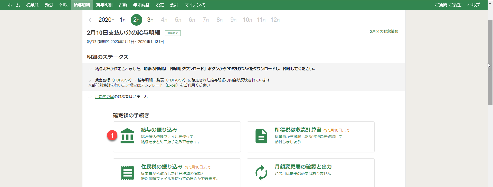
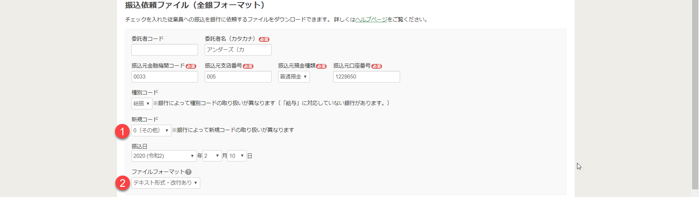
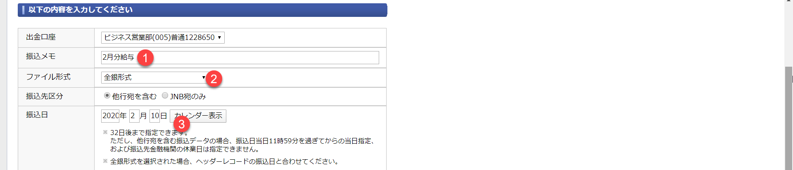

労務freeeの給与振込の機能を使います。振込依頼ファイルは全銀フォーマットと呼ばれる伝統的な形式ですが、内容を理解する必要はありません。銀行によっては、微妙に仕様が異なるため、ファイル作成のパラメータの設定は、ここで紹介する通りに行います。

1. 労務freeeから**給与の振り込み**を押します。

2. **振込依頼ファイルを作成**します。

3. ジャパネット銀行で**振込データ作成**をします。前のステップで作成したファイルをアップロードします。

> **TIPS**: ファイル作成時のパラメータが正しくない場合は、ファイルアップロード時に銀行側でエラーが発生します。その場合は手順を見直してください。

