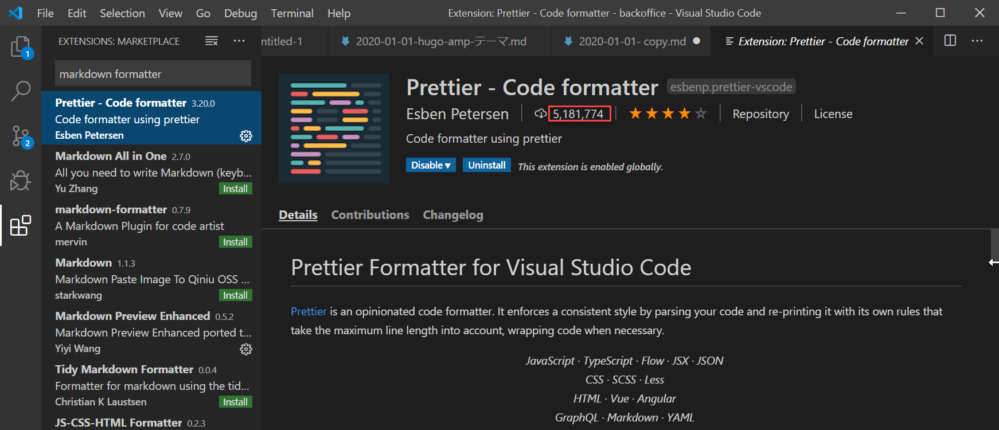

Prettier（プリティア）は、コードを自動整形してくれるツールです。マークダウンの他、JSやCSSなど、複数の言語に対応しています。予め定義してある書式に、自動的にフォーマットはしますが、構文まではチェックしません。構文チェックは別のツールをなります。

[VS Code上でファイル保存時にPrettierを走らせる](https://qiita.com/Naturalclar/items/690be378984b3a24a138)

[VS CodeにPrettier・ESLint・Stylelintを導入してファイル保存時にコードを自動整形させる方法](https://wemo.tech/3307)

[VSCode】Prettierの使い方＆おすすめ設定を紹介](https://ma-vericks.com/vscode-prettier/)