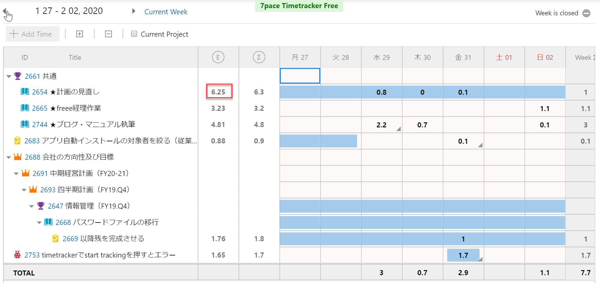

ふりかえりは、仕事の改善をするのに最も重要の一つで、有名なメソッドがKPT。Keep/Problem/Tryの略。ケプトと呼ぶ。

ケプトの意味

- Keep 良かったこと
- Problem まずかったこと
- Try 次に試したいこと

一定のタイミングで、これら3つを洗い出して、作業の改善に役立てる。チームでやってもいいし、要するに反省と今後の対策なんだから、個人でやっても、意味がある。

# やり方

一定のタイミング、例えば毎月など一定期間ごとや、イテレーションやマイルストーンの区切りでいい。

次の3つをやる

1. 個人でKeep/Problem/Tryを付箋などに書き出す
2. 個人毎に発表する
3. 個人のKPTをとりまとめ、チームのKPTを決める

個人の発表が終わった時点で、すでに個人レベルでのKTPは自分で認識されたので、これだけでも効果がある。つまりチームのKPTはオプションということになる。

# KPTの例

太郎さん。担当は経理総務。TimeTrackerのエビデンスからKPTをした。

> 
>
> 1. Keep
> ブログの執筆ができている。
>
> 2. Problem
> 予定の見直しの時間が多い
>
> 3. Try
> 毎日予定を見ているせいで、見直し時間がたくさんある。イテレーションごとに予定は見直しているわけだから、本来それに沿っていけば、その業務に集中できる。

# 当社の運用

金曜日のイテレーションを締めた際に、マネージャーへKPTのレポートする。

# 参考

[【徹底解説】正しい「KPT」が仕事の成果を生み出す！進め方のコツ、現場の事例を紹介](https://seleck.cc/kpt)

[KPTふりかえり会 進め方のヒント](http://objectclub.jp/download/files/pf/KPT_TIPS.pdf)

[最強の振り返りフレームワーク「KPT」とは？](https://venturetimes.jp/venture-news/column/48269.html)
