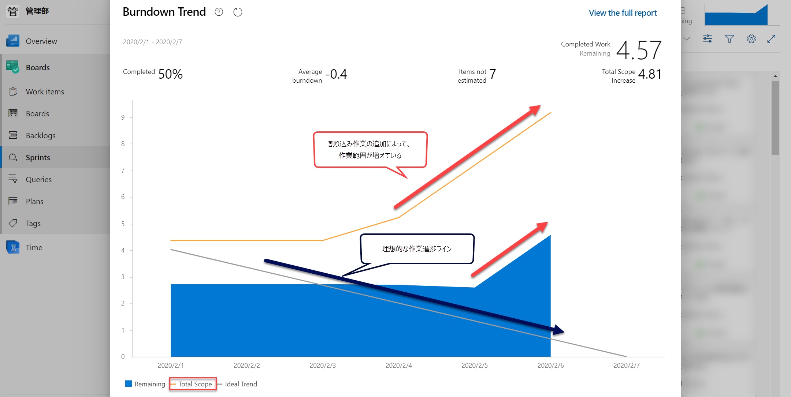

This is an example page. It's different from a blog post because it will stay in one place and will show up in your site navigation (in most themes). Most people start with an About page that introduces them to potential site visitors. It might say something like this:

> Hi there! I'm a bike messenger by day, aspiring actor by night, and this is my website. I live in Los Angeles, have a great dog named Jack, and I like pi'a coladas. (And gettin' caught in the rain.)

...or something like this:

> The XYZ Doohickey Company was founded in 1971, and has been providing quality doohickeys to the public ever since. Located in Gotham City, XYZ employs over 2,000 people and does all kinds of awesome things for the Gotham community.

You should probably delete this page and create new pages for your content. Have fun!

:warning: aaaaabbbbb

**Please Note:** Paths for image headers, overlays, teasers, [galleries]({{ "/docs/helpers/#gallery" | relative_url }}), and [feature rows]({{ "/docs/helpers/#feature-row" | relative_url }}) have changed and now require a full path. Instead of just `image: filename.jpg` you'll need to use the full path eg: `image: assets/images/filename.jpg`. The preferred location is now `assets/images` but can be placed elsewhere or external hosted. This all applies for image references in `_config.yml` and `author.yml` as well.
{: .notice--danger}
