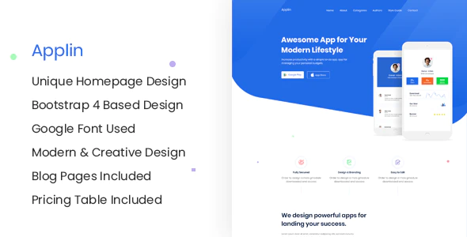

プレミアムのあるjekyllの有料テーマを、選ぶ方法について書きます。

# ジキルのテーマ選びは次の3つのサイトから行います。

- JEKYLL THEMES https://jekyllthemes.io/
- JEKYLL THEMES (同名) https://jekyll-themes.com/ プレミアムテーマコーナーあり
- envatomarket
https://themeforest.net/category/static-site-generators/jekyll

> 次のテーマサイトもJekyllの公式サイトより紹介がある。目を引くものが少ないので、ここでは除外した。
> http://jekyllthemes.org/
> https://jamstackthemes.dev/ssg/jekyll/

# コーポレートサイトで使えるモダンなテーマを選ぶ

日本の企業で使える、モダン、ミニマルデザインの条件で探してみた。

1. **Applin**。Themeix社製。

2. **Made**

1. Cloven 

1. Vinex

1. Omnivus ITソリューション会社向け。

1. Churel themeix社製。チャット機能あり。

> **参考**: themeix社のjekyllテーマページを見るには
> https://themeix.com/product/category/jekyll-themes/

# 番外編 ドキュメント格納場所として使えるテーマ

1. **Documenter**。Themeix社製。

2. **Dox**。Themejack_社製。

