プレミアムのあるjekyllの有料テーマを、選ぶ方法について書きます。

# jekyllのテーマ選びは3つのサイトが入口となる

1. [JEKYLL THEMES](https://jekyllthemes.io/)  
クリエイターであり開発者でもあるマイクハマー氏によるテーマ。他社製品も含まれているが、自社製品にはロゴが入っている。

2. [JEKYLL THEMES (上記と同名サイト)](https://jekyll-themes.com/ )   
運営者は不明。Themeix社などメジャーなメーカーのテーマが販売されている。プレミアムテーマコーナーあり

3. [envatomarket](https://themeforest.net/category/static-site-generators/jekyll)   
ソート・検索機能が充実。特に発売日順にすると、新しいテーマがわかる。

> **参考**: ここで紹介した以外に、2つのテーマサイトがJekyllの公式サイトで紹介されている。分類やソートがなく、これというものがすぐ見つからなかったので、ここでは除外した。時間があれば、見てみてほしい。
> - http://jekyllthemes.org/
> - https://jamstackthemes.dev/ssg/jekyll/

# 日本企業のコーポレートサイトで使えるモダンなテーマを選ぶ

日本の企業で使える、モダン、ミニマルデザインの観点にて探して、作成元別に整理した。

## Themeix社のテーマ

[Themeix社のテーマ](https://themeix.com/product/category/jekyll-themes/)は、ヘッダーとフッターにこだわりがある。多くのテーマを販売しています。しかしPageSpeedの結果はとても良くはない。

### Applinテーマ by Themeix

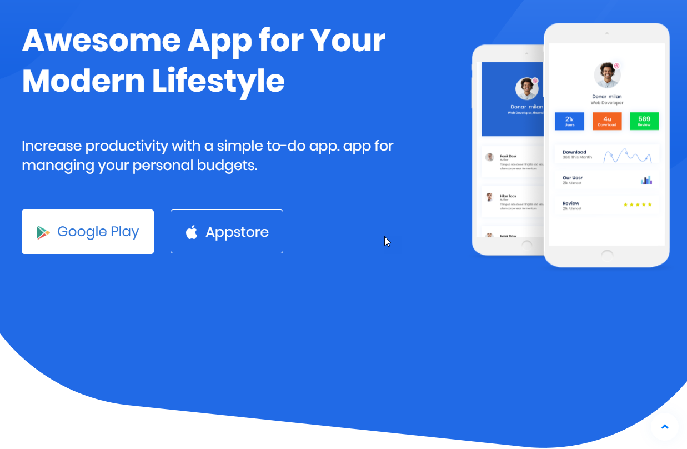

[デモ](https://jekyll-applin.netlify.com/)

||モバイル|デスクトップ|
|--|--|--|
|PageSpeed Insights|34|84|

### Churelテーマ by themeix

チャット機能がある。

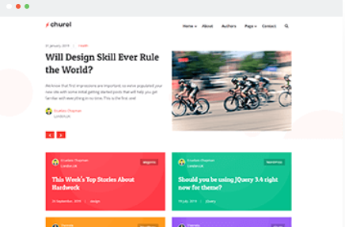

[デモ](https://jekyll-churel.themeix.com/)

||モバイル|デスクトップ|
|--|--|--|
|PageSpeed Insights|67|79|

## Get Jekyll Themes社のテーマ

[Get Jekyll Themes社](https://getjekyllthemes.com/)は、Jekyllを専門にテーマを販売しているよう。5つのテーマが商品カタログにある。

### Dizer by Get Jekyll Themes

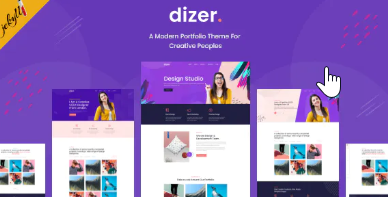
[ライブデモ](https://dizer.netlify.com/)

||モバイル|デスクトップ|
|--|--|--|
|PageSpeed Insights|77|99|

### Airspace Jekyll by Get Jekyll Themes

こちらは無料のテーマ。

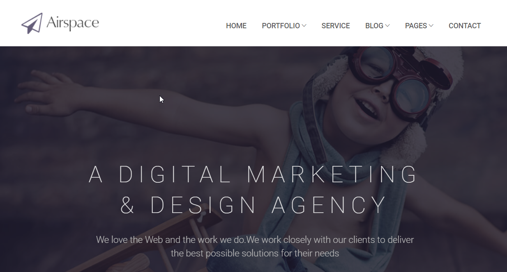

[ライブデモ](http://demo.themefisher.com/themefisher/airspace/)

||モバイル|デスクトップ|
|--|--|--|
|PageSpeed Insights|72|92|

## Jekyll Themes社のテーマ

[Jekyll Themes社](https://jekyllthemes.io/)は、イギリスのマイクハーマー氏によって作成されました。PageSpeedの結果が平均的に優れている。

### Made by Jekyll Themes

モバイルの画面が左右に格納されたユニークなサイト。見た目がきれい。

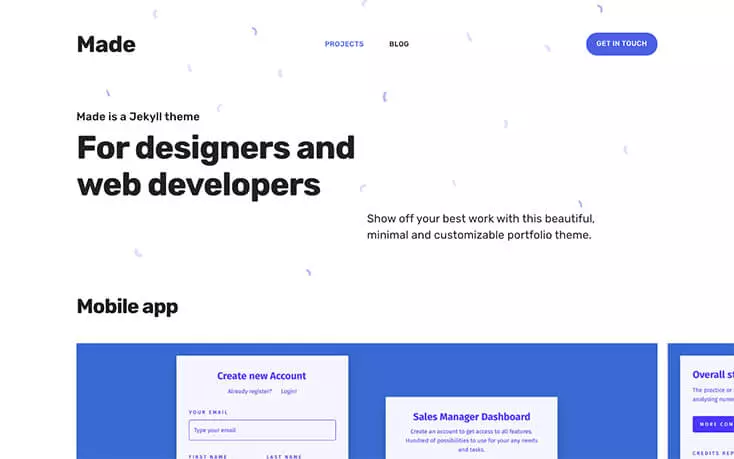

[デモ](https://made.jekyllthemes.io/)

||モバイル|デスクトップ|
|--|--|--|
|PageSpeed Insights|94|99|

### Agency Jekyll theme

Jekyll Themes社の有料テーマのうち、一つだけ無料が提供されている。

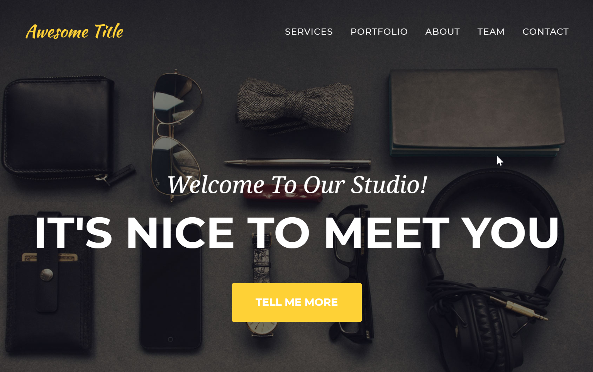

[デモ](https://y7kim.github.io/agency-jekyll-theme/)

||モバイル|デスクトップ|
|--|--|--|
|PageSpeed Insights|90|99|

## Theme-Downloaded社のテーマ

[Theme-Downloaded社](https://themeforest.net/user/theme-downloaded/portfolio)は、3つのテーマを販売しています。会社のホームページが見つかりません。

### Cloven by Theme-Downloaded

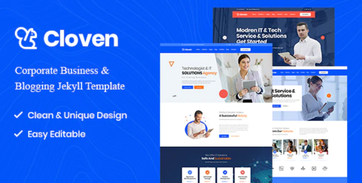

[デモ](https://cloven.netlify.com/)

||モバイル|デスクトップ|
|--|--|--|
|PageSpeed Insights|62|86|

## Themeaffair社のテーマ

[Themeaffair社](https://themeforest.net/user/themeaffair/portfolio)は、8のテーマを販売している。会社のホームページが見つからない。

### Vinex by Themeaffair

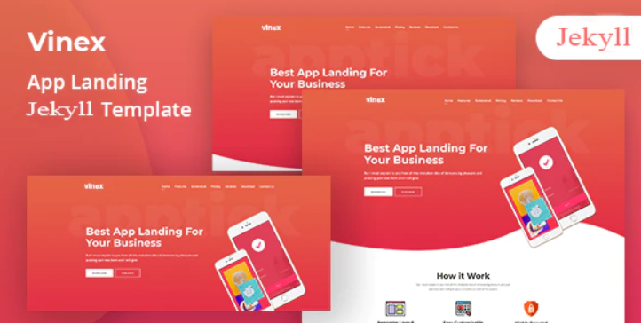
デモ
https://vinex.netlify.com/

||モバイル|デスクトップ|
|--|--|--|
|PageSpeed Insights|48|74|

## Anvod Studio社

[Anvod Studio社](https://anvodstudio.com/#jekyll-themes)はキレイ目のテーマを作っている会社です。

### Caitlinテーマ by Anvod Studio社

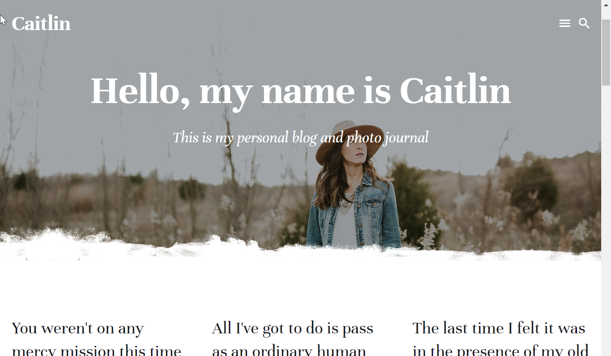
デモ
https://caitlin-jekyll.netlify.com/

||モバイル|デスクトップ|
|--|--|--|
|PageSpeed Insights|88|95|

## bcore社のテーマ

bcore社は、ITソリューションのコーポレートサイト向けテーマに強い会社です。

### Omnivusテーマ by bcore
ITソリューション会社向け。
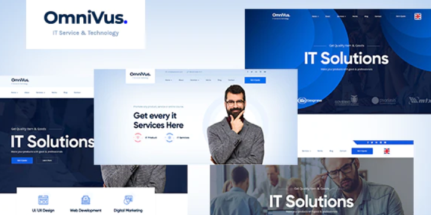
デモ
https://gizmoder.com/demo/html/omnivus/omnivus/index.html

||モバイル|デスクトップ|
|--|--|--|
|PageSpeed Insights|59|69|

# 番外編：無料テーマ

無料テーマですが高品質ですので他のプレミアムテーマと一緒に紹介しています。

### Blackrockdigitalテーマ at Github

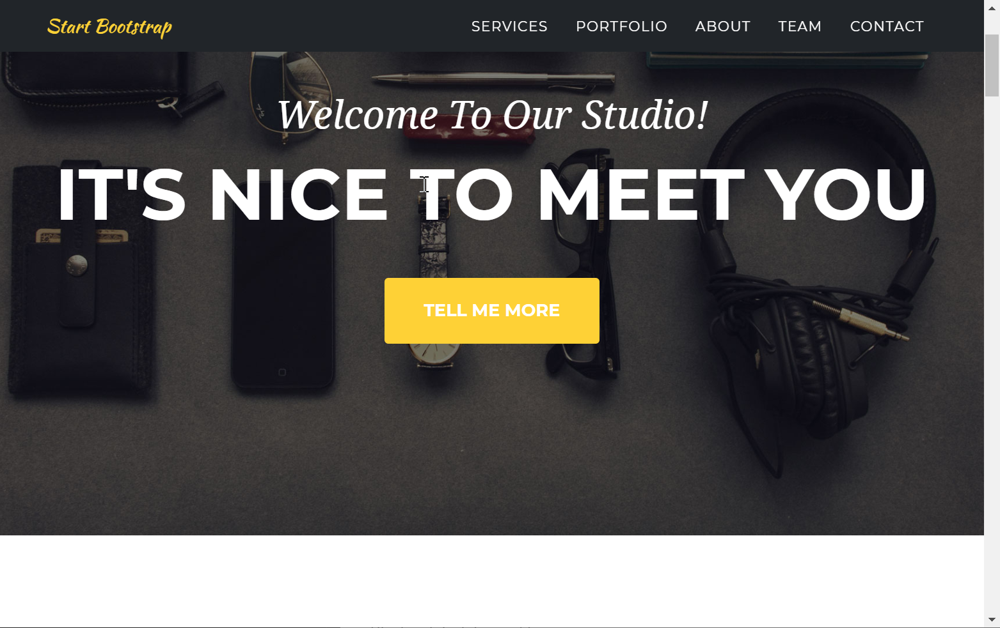

[デモ](https://blackrockdigital.github.io/startbootstrap-agency/)

||モバイル|デスクトップ|
|--|--|--|
|PageSpeed Insights|75|97|

# 番外編 ドキュメント格納場所として使えるテーマ

1. **Documenter**。Themeix社製。

2. **Dox**。Themejack_社製。
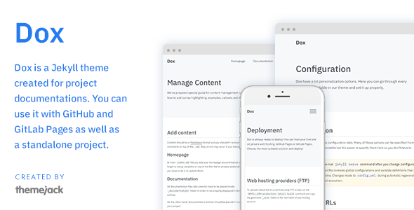
